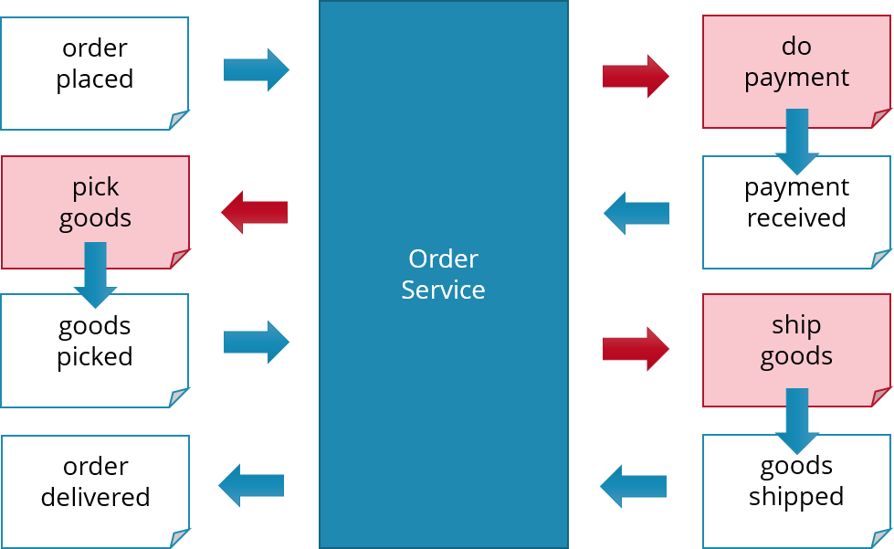
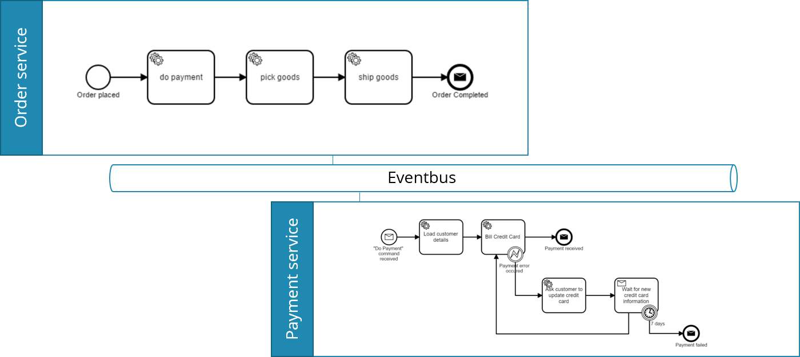

# Flowing retail sample application

This sample application showcases *concepts and alternatives* to implement

* a simple order application

in the context of

* Domain Driven Design (DDD)
* Event Driven Architecture (EDA)
* Microservices (µS)

Key facts:

* Written in Java
* As simple as possible to show concepts, not build for production usage. Hint: we know some parts in the code skip well known best practices and patterns, but we focussed on making the code easy to understand. For example we prefer to duplicate code, if this means you have to read one class less to understand what a component is doing.

# Overview and architecture

Flowing retail simulates a very easy order processing system. The business logic is separated into the following microservices:


* The core domains communicate via messages with each other.
* Messages might contain *events* (blue in the following picture) or *commands* (red)



This is the stable nucleus for flowing retail.

## Alternatives

Now there are a couple of options you can choose of when running / inspecting the example. 

### Channel technology

You can choose between:

* [Apache Kafka](http://kafka.apache.org/) *default* as event bus.
* [RabbitMQ](https://www.rabbitmq.com/) as AMQP messaging system.

### Long running processes

In order to support [long running processes](xxx) there are multiple options, which are very interessting to compare:

* Domain entities store state (Option ```entity```)
* [Camunda](http://camunda.org/) *default* workflow engine orchestrates using BPMN models (option ```camunda```)
* [Camunda](http://camunda.org/) workflow engine orchestrates using a technical DSL (option ```camunda-dsl```)

Note that every component does its own parts of the overall order process. As an example this is illustrated using BPMN and showing the Order and Payment Service with their processes:




# Run the application

* Download or clone the source code
* Run a full maven build

```
mvn package
```

* Start all components by in one Java process
    * Channel (e.g. Kafka which also requires Zookeeper)
    * All microservices

```
mvn -f starter exec:java
```

If you want to select options you can also do so:

```
mvn -f starter exec:java -Dexec.args="rabbit camunda-dsl"
```

You can also import the projects into your favorite IDE and start the following class yourself:

```
starter/io.flowing.retail.command.SimpleStarter
```

* Now you can place an order via [http://localhost:8085](http://localhost:8085)

## Using Kafka

* Can be started built in, but you can also install and run yourself
* Port = default = ## 

When installed yourself, create topic *"flowing-retail"*

```
kafka-topics.sh --create --zookeeper localhost:2181 --replication-factor 1 --partitions 1 --topic flowing-retail
```

You can query all topics by: 

```
kafka-topics.sh --list --zookeeper localhost:2181
```

## Using RabbitMQ

* Must be installed and started yourself
* Port = default = ##

## Using Camunda

You can inspect what's going on using Cockpit:

* Download Camunda Distribution of your choice
* Configure Datasource to connect to: jdbc:h2:tcp://localhost:8092/mem:camunda
* Best: Do not start job executor
* Run it and you can use cockpit normally


# OLD CONTENT

## Channel Kafka

* Install Kafka
* Start Kafka


